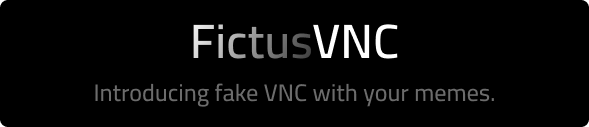
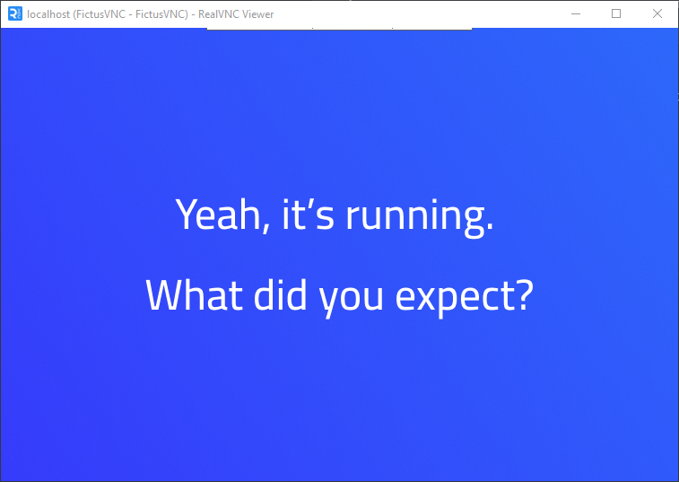

# FictusVNC

Minimal VNC server that sends a static PNG image to any VNC client.
Supports 8/24/32 bpp pixel formats — including RealVNC compatibility.



---

## ⚙️ Features

* 🖼 Serve static PNG as framebuffer
* 🖥 Supports RealVNC / UltraVNC / TightVNC clients
* 🛠 Configurable via `servers.toml`
* 📶 Multi-instance support (multiple ports/images)
* 💾 Cross-platform: Linux, Windows, macOS, ARM64
* 📉 Lightweight: \~2.8MB binary

---

## 🚀 Quick Start

* [▶️ Run without config](#run-without-config)
* [⚙️ Run with config (`servers.toml`)](#run-with-config)
* [🗂 Preview](#preview)

---

### ▶️ Run without config

```bash
./fictusvnc-linux-amd64 :5905 images/test.png
```

---

### ⚙️ Run with config

Create `servers.toml`:

```toml
[[server]]
listen = ":5900"
image = "default.png"
server_name = "My First Fake VNC"

[[server]]
listen = "127.0.0.1:5901"
image = "meme.png"
server_name = "Meme Server"
```

Then run:

```bash
./fictusvnc-linux-amd64
```

---

### 🗂 Preview


