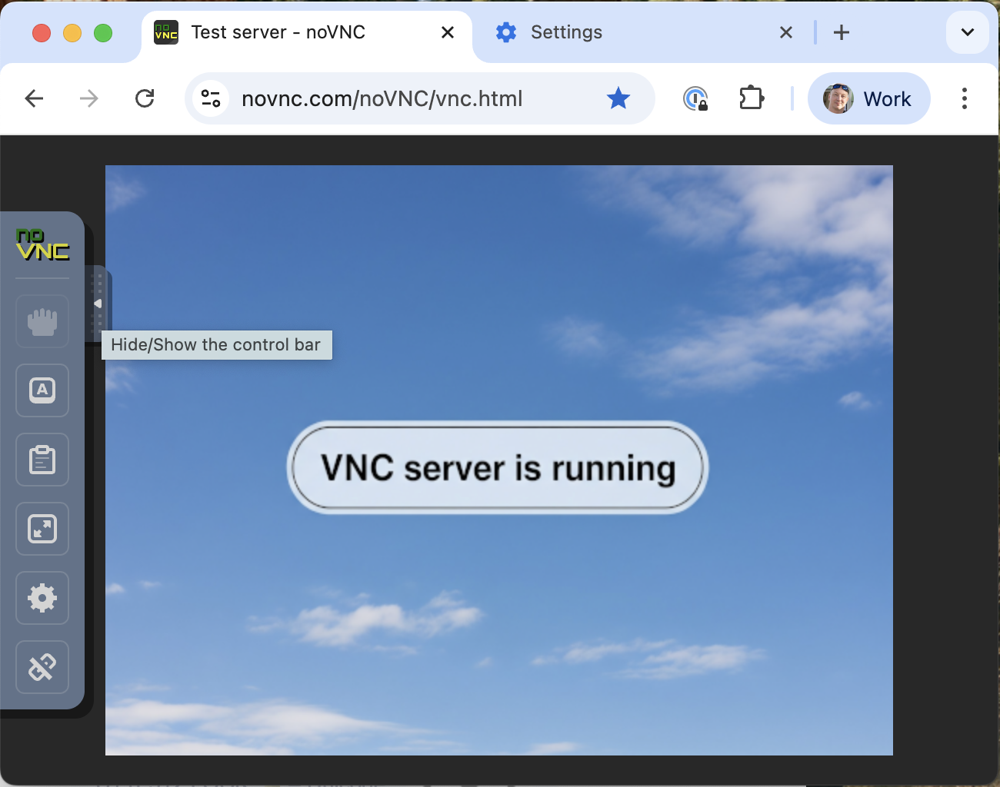

# FictusVNC Server

A minimal VNC server that serves a static image.


---

## ⚙️ Features

* 🖼 Serve static PNG as framebuffer
* 🖥 Supports RealVNC / UltraVNC / TightVNC clients
* 🛠 Configurable via `servers.toml`
* 📶 Multi-instance support (multiple ports/images)
* 💾 Cross-platform: Linux, Windows, macOS, ARM64
* 📉 Lightweight: ~2.8MB binary

---

## 🚀 Quick Start

* [▶️ Run without config](#run-without-config)
* [⚙️ Run with config (`servers.toml`)](#run-with-config)
* [🗂 Preview](#preview)

---

### ▶️ Run without config

```bash
./fictusvnc-linux-amd64 :5905 images/test.png
```

---

### ⚙️ Run with config

Create `servers.toml`:

```toml
[[server]]
listen = ":5900"
image = "default.png"
server_name = "My First Fake VNC"

[[server]]
listen = "127.0.0.1:5901"
image = "meme.png"
server_name = "Meme Server"
```

Then run:

```bash
./fictusvnc-linux-amd64
```

---

### 🗂 Preview



---

## Available Flags

| Flag             | Description                                 | Default Value      |
|------------------|---------------------------------------------|--------------------|
| `--config`       | Path to TOML configuration file             | `./servers.toml`   |
| `--name`         | Default server name                         | `FictusVNC`        |
| `--no-brand`     | Disable "FictusVNC -" prefix in server name | `false`            |
| `--version`, `-v`| Show version and exit                       | `false`            |
| `--show-ip`      | Display client IP on the image              | `false`            |

---

## Example Run with Flags

```bash
go run . --config test.toml --show-ip
```

---

## Configuration

Example TOML configuration file:

```toml
[[server]]
listen = "127.0.0.1:5900"
server_name = "Test Server"
image = "test.png"
```

---

## License

This project is licensed under the terms specified in the [LICENSE](LICENSE) file.
